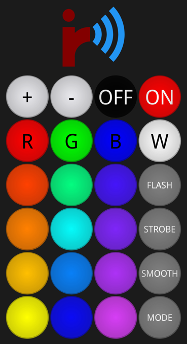

# IRWA

A simple web app for sending out IR signals to control OSRAM LED Star RGB light bulbs from an ESP32, written using nanoFramework.

## Screenshot

## Setup guide

_IRWA_ can either be deployed directly using the most recent deployment image and [nanoff](https://github.com/nanoframework/nanoFirmwareFlasher), or compiled and deployed manually from source using the Visual Studio 2022 solution, which requires the nanoFramework extension for Visual Studio. With this extension being installed, the solution can then be opened and either directly executed and debugged (which gives access to useful debug output), or built and deployed to the board.

Please note that, in any case, the WiFi network must be configured on the ESP32. This can be easily done using the nanoFramework extension for Visual Studio - after filling out all the required fields, the WiFi options should be set to "Enable". When the application is debugged, the debug output will show when the connection was successfully established (and with which IP).

By default, the the infrared signal is sent through the pin `23`. The anode (+) of a suitable IR LED should be connected to that pin, and the cathode (-) to the pin `GND`. This was tested successfully with a HSDL-4230 that was readily available, which was connected directly without an additional resistor.

It is possible to change the API URL by clicking onto the logo in the app - but this parameter is only useful for advanced setups and should remain empty for most cases.

## Architecture and customisation

This application consists of a backend, written in C# using nanoFramework, that provides both an API and the frontend itself, which is written in plain HTML/JS/CSS. As the application was written in just a few days, it is very simple and doesn't feature options to configure or customize it from within the app, as this would go beyond the scope of this project. The layout or appearance of the buttons and the commands they send out, however, can be easily modified by just changing the main ``index.html`` - with this, the application could be easily modified to control other IR devices.

The IR commands are 32-bit unsigned integers encoded using the NEC protocol - see the ``IrSenderNec.cs`` file for the implementation of that. As there aren't many examples or resources available on how to do this, the class has been documented extensively to provide an additional "learning value" and explain how to send out IR signals on an ESP32. For this project, the commonly used NEC protocol is implemented, where commands are 32-bit unsigned integers which get modulated onto a 38kHz wave using PWM.

The web server is a custom implementation using the `HttpListener` from `System.Net.Http`, executing the incoming requests using a thread pool (in the hopes of better performance due to the recycling of the same threads instead of spawning new ones for every request). The web server implementation was also optimized for improved stability and resilience against network outages or other unexpected issues and should recover from such events. It has support for HTTPS, but while testing this feature, the app became almost unusable in terms of speed, which is why HTTP is used for now. That, unfortunately, prevents the app from being installed as PWA, as all other requirements for this would be fulfilled.

## License

### Logo

The IRWA logo (appicon.svg, logo.svg) is licensed under [CC BY-SA 4.0](https://creativecommons.org/licenses/by-sa/4.0/).

### Software

Copyright 2024, Maximilian Bauer

Permission is hereby granted, free of charge, to any person obtaining a copy of this software and associated documentation files (the “Software”), to deal in the Software without restriction, including without limitation the rights to use, copy, modify, merge, publish, distribute, sublicense, and/or sell copies of the Software, and to permit persons to whom the Software is furnished to do so, subject to the following conditions:

The above copyright notice and this permission notice shall be included in all copies or substantial portions of the Software.

THE SOFTWARE IS PROVIDED “AS IS”, WITHOUT WARRANTY OF ANY KIND, EXPRESS OR IMPLIED, INCLUDING BUT NOT LIMITED TO THE WARRANTIES OF MERCHANTABILITY, FITNESS FOR A PARTICULAR PURPOSE AND NONINFRINGEMENT. IN NO EVENT SHALL THE AUTHORS OR COPYRIGHT HOLDERS BE LIABLE FOR ANY CLAIM, DAMAGES OR OTHER LIABILITY, WHETHER IN AN ACTION OF CONTRACT, TORT OR OTHERWISE, ARISING FROM, OUT OF OR IN CONNECTION WITH THE SOFTWARE OR THE USE OR OTHER DEALINGS IN THE SOFTWARE.
